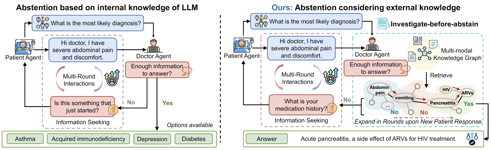

## <div align="center"> KnowGuard: Knowledge-Driven Abstention for Multi-Round Clinical Reasoning <div>

#### <div align="center"> ICLR 2026 <div>
<div align="center">
<a href=https://arxiv.org/abs/2509.24816 target="_blank"></a>
</div>
<div align="center">
  <br>
  <a href="https://icecreamartist.github.io/" target="_blank">Xilin Dang*<sup>1</sup></a>,&nbsp;
  <a href="" target="_blank">Kexin Chen*<sup>1,2</sup></a>,&nbsp;
  <a href="" target="_blank">Xiaorui Su<sup>2</sup></a>,&nbsp;
  <a href="" target="_blank">Ayush Noori<sup>2</sup></a>,&nbsp;
  <a href="" target="_blank">Iñaki Arango<sup>2</sup></a>,&nbsp;
  <a href="" target="_blank">Lucas Vittor<sup>2</sup></a>,&nbsp;
  <a href="" target="_blank">Xinyi Long<sup>1</sup></a>,&nbsp;
  <a href="" target="_blank">Yuyang Du<sup>1</sup></a>,&nbsp;
  <a href="" target="_blank">Marinka Zitnik<sup>&#x2709;2</sup></a>,&nbsp;
  <a href="https://appsrv.cse.cuhk.edu.hk/~pheng/index.php" target="_blank">Pheng-Ann Heng<sup>1</sup></a>
</div>


<div align="center">
  <br>
  <sup>1</sup>The Chinese University of Hong Kong
  <sup>2</sup>Harvard Medical School
  <br>
  <sup>*</sup> Equal Contribution&emsp;
  <sup>&#x2709;</sup> Corresponding Author
</div>

<p align="center">
  
</p>


## Citation

If you find our work useful in your research, please consider citing:

``` bibtex
@misc{dang2025knowguardknowledgedrivenabstentionmultiround,
      title={KnowGuard: Knowledge-Driven Abstention for Multi-Round Clinical Reasoning}, 
      author={Xilin Dang and Kexin Chen and Xiaorui Su and Ayush Noori and Iñaki Arango and Lucas Vittor and Xinyi Long and Yuyang Du and Marinka Zitnik and Pheng Ann Heng},
      year={2025},
      eprint={2509.24816},
      archivePrefix={arXiv},
      primaryClass={cs.CL},
      url={https://arxiv.org/abs/2509.24816}, 
}
```

## Acknowledgements

We thank for their open-source implementations: [MediQ](https://github.com/stellalisy/MediQ).


